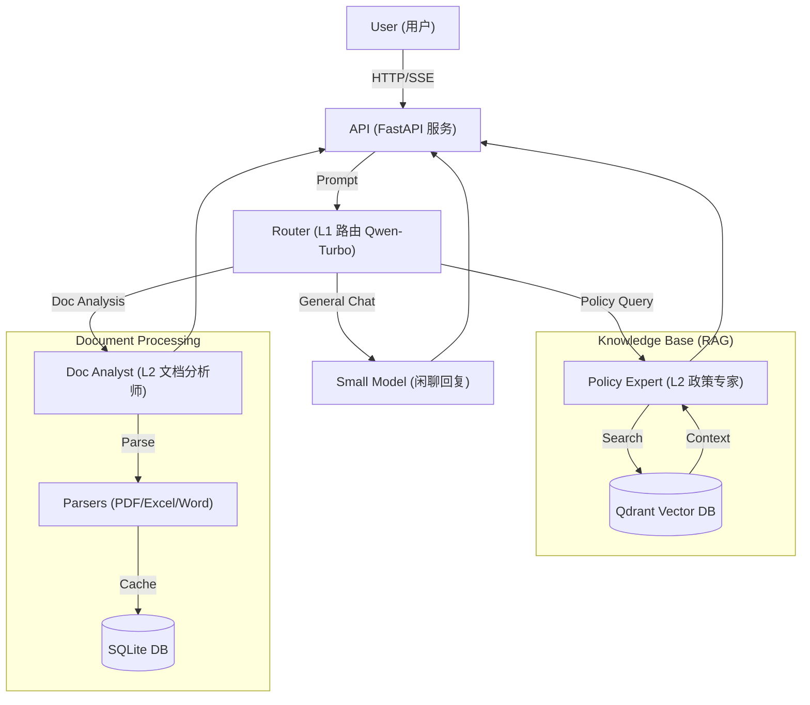

# GreenCredit AI - 绿色信贷智能助手

<div align="center">
  
  <br>
  <p>面向信贷经理的“极简、极速”绿色信贷业务辅助专家</p>
  <p>
    
    
    
    
  </p>
</div>

## 📖 项目简介 (Introduction)

**GreenCredit AI** 是一个基于大语言模型（LLM）的垂直领域智能助手，旨在解决绿色信贷业务中政策查询难、非结构化报告（ESG/财报）分析慢的痛点。

系统采用 **大小模型分层架构 (Model Cascading)**，在保证响应速度的同时降低成本：
*   **L1 路由层 (Qwen-Turbo)**：毫秒级意图识别，闲聊秒回。
*   **L2 专家层 (Qwen-Max)**：深度 RAG 检索与文档分析。

### ✨ 核心特性 (Features)

*   🧠 **智能意图路由**：自动识别闲聊、政策查询、文档分析意图。
*   📚 **政策知识库 (RAG)**：内置绿色信贷政策库，基于 Qdrant 向量检索提供精准回答。
*   📊 **文档深度分析**：支持上传 **PDF/Excel/Word**，自动提取财务指标与 ESG 风险。
*   ⚡ **流式响应 (SSE)**：全链路流式输出，极致的打字机体验。
*   💾 **会话持久化**：基于 SQLite 的历史记录存储，自动生成会话标题。
*   🎨 **现代 UI**：复刻 Gemini 风格的极简界面，支持 Markdown 渲染与暗色侧边栏。

---

## 🛠️ 技术架构 (Architecture)



---

## 🚀 快速开始 (Quick Start)

### 1. 环境准备

确保已安装 Python 3.10+ 和 `uv` (推荐) 或 `pip`。

```bash
# 克隆项目
git clone https://github.com/yourusername/GreenCreditAI.git
cd GreenCreditAI

# 创建虚拟环境并安装依赖
uv sync
# 或者使用 pip
# pip install -r requirements.txt
```

### 2. 配置环境变量

复制 `.env.example` 为 `.env`，并填入您的阿里云 DashScope API Key。

```ini
# .env
DASHSCOPE_API_KEY="sk-xxxxxxxxxxxxxxxxxxxxxxxx"

# 可选配置
MODEL_ROUTER_NAME="qwen-turbo"
MODEL_EXPERT_NAME="qwen-max"
```

### 3. 初始化知识库

将您的政策文档（PDF/TXT/JSON）放入 `knowledge_base/` 目录，然后运行入库脚本：

```bash
uv run python scripts/ingest_docs.py
```

### 4. 启动服务

```bash
uv run python -m app.main
```

打开浏览器访问：[http://127.0.0.1:8000](http://127.0.0.1:8000)

---

## 📂 项目结构 (Project Structure)

```text
GreenCreditAI/
├── app/
│   ├── api/            # API 路由 (Chat, Upload)
│   ├── core/           # 核心配置 (DB, Config, Logging)
│   ├── models/         # SQLModel 数据库模型
│   ├── parsers/        # 文档解析器 (PDF, Office)
│   ├── rag/            # 向量数据库封装 (Qdrant)
│   ├── services/       # 业务逻辑 (Agents, Session, Document)
│   └── templates/      # 前端模版 (Jinja2)
├── knowledge_base/     # 原始政策文档
├── scripts/            # 工具脚本 (Ingestion)
├── static/             # 静态资源 (CSS, JS, SVG)
└── tests/              # 单元测试
```

## 🛡️ 免责声明

本项目生成的回答由 AI 提供，仅供参考，不构成最终信贷审批依据。请务必核实重要信息。

## 📄 License

MIT License
